# Deep Agents: Why Most AI Agents Are Shallow (And How to Fix It)


A complete guide to building AI agents that actually plan, delegate, and remember. Learn the architecture behind Claude Code, Deep Research, and how to build production-ready deep agents with LangChain.

---

## Table of Contents

1. [The Problem: Why Most Agents Are Shallow](#the-problem-why-most-agents-are-shallow)
2. [What Makes an Agent "Deep"?](#what-makes-an-agent-deep)
3. [Deep Agents in the Wild](#deep-agents-in-the-wild)
4. [Pillar 1: Planning Tools](#pillar-1-planning-tools)
5. [Pillar 2: File Systems](#pillar-2-file-systems)
6. [Pillar 3: Subagents](#pillar-3-subagents)
7. [Pillar 4: Detailed System Prompts](#pillar-4-detailed-system-prompts)
8. [The Middleware Architecture](#the-middleware-architecture)
9. [Context Engineering: The Hidden Art](#context-engineering-the-hidden-art)
10. [Building Your First Deep Agent](#building-your-first-deep-agent)
11. [Advanced Deep Agent Patterns](#advanced-deep-agent-patterns)
12. [Deep Agents vs Traditional Agents](#deep-agents-vs-traditional-agents)
13. [Production Deployment](#production-deployment)
14. [Real-World Use Cases](#real-world-use-cases)
15. [The Hard Problems](#the-hard-problems)
16. [Framework Comparison](#framework-comparison)
17. [Common Mistakes](#common-mistakes)
18. [The Future of Deep Agents](#the-future-of-deep-agents)
19. [The Bottom Line](#the-bottom-line)
20. [Further Reading](#further-reading)

---

## The Problem: Why Most Agents Are Shallow

You build an AI agent. It can search the web, analyze data, even write code. You give it a task: "Research the top 5 AI companies hiring in San Francisco, analyze their job openings, and write personalized cover letters for each."

Your agent searches once. Gets overwhelmed. Writes one generic cover letter. Forgets companies 2 through 5. Fails completely.

Sound familiar?

This is what I call a "shallow" agent. Using an LLM to call tools in a loop is the simplest form of an agent, but this architecture yields agents that fail to plan and act over longer, more complex tasks.

Here is what typically happens with shallow agents:

```
User: "Find me jobs and write cover letters for 5 companies"

Shallow Agent Process:
→ Searches: "AI companies SF hiring"
→ Gets 50 results, context starts filling up
→ Picks first company, writes generic letter
→ Tries to continue but context is full of search results
→ Forgets the task had 5 companies
→ Returns incomplete work

Result: FAILURE
```

The agent has no plan. No way to manage context. No ability to break down the task. It is reacting, not thinking.

Now watch what happens with a deep agent:

```
User: "Find me jobs and write cover letters for 5 companies"

Deep Agent Process:
→ Writes TODO list:
   1. Search for AI companies in SF
   2. Research each company (spawn subagent for each)
   3. Find job openings for each
   4. Write personalized cover letters
→ Executes step 1: Searches broadly
→ Stores company list in companies.md file
→ For each company:
   → Spawns research subagent with isolated context
   → Subagent deep-dives on that company
   → Stores findings in company_X_research.md
→ Reads research files
→ Writes 5 personalized, specific cover letters

Result: SUCCESS
```

The difference? Four key capabilities:

1. **Planning** - Breaks down the task before starting
2. **File system** - Manages context by offloading to files
3. **Subagents** - Delegates specialized work
4. **Detailed prompts** - Knows how to use these capabilities

These are not optional extras. These are what make an agent deep.

Here is the thing: the core algorithm is exactly the same. Both agents are just LLMs running in a loop calling tools. The difference is in the architecture around that loop.

Applications like Claude Code, OpenAI's Deep Research, and Manus have proven this architecture works. People started using Claude Code for tasks way beyond coding - research, planning, analysis - and it worked. Why? Because it had these four pillars.

---

## What Makes an Agent "Deep"?


Let me show you the difference in code.

### Shallow Agent Architecture

```python
# Traditional "shallow" agent
def shallow_agent(task):
    history = []

    while not done:
        # Everything crammed into one context
        thought = llm.generate(task + history)
        action = select_tool(thought)
        result = execute(action)

        # Context grows unbounded
        history.append(result)

        # No plan, just reacting
        # No way to delegate
        # No persistent storage
```

This works for simple tasks. "What is 2+2?" Great. "Search for Python tutorials." Perfect.

It fails for "Research quantum computing developments in 2024, compare approaches from IBM, Google, and Microsoft, and create a detailed technical report."

### Deep Agent Architecture

```python
# "Deep" agent with planning, files, and subagents
def deep_agent(task):
    # First: Make a plan
    todos = agent.write_todos(task)
    # → ["Research quantum computing 2024",
    #    "Compare IBM/Google/Microsoft approaches",
    #    "Create technical report"]

    for subtask in todos:
        if needs_deep_focus(subtask):
            # Spawn subagent with isolated context
            subagent = spawn_subagent(
                name="researcher",
                task=subtask
            )
            result = subagent.run()

            # Store in file system
            filesystem.write(f"{subtask}.md", result)
        else:
            # Execute directly
            result = execute_tools(subtask)

        # Adapt plan based on what we learned
        todos = agent.update_todos(result)

    # Read all research files
    research = filesystem.read_all("*.md")

    # Generate final output
    return synthesize(research)
```

See the difference? Planning. Context management. Delegation. Adaptation.

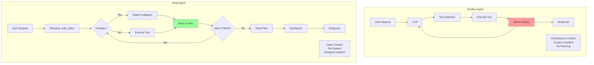

### The Four Pillars

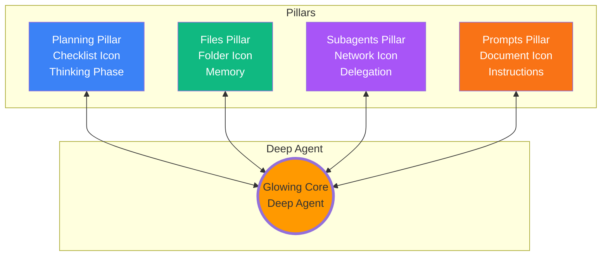

Every successful deep agent has these four components:

**1. Planning Tool**

- Explicitly breaks down complex tasks
- Tracks progress through steps
- Adapts plan as new information emerges
- Example: Claude Code's TODO list

**2. File System**

- Offloads context from LLM memory
- Stores intermediate results
- Enables collaboration between agents
- Persistent across sessions

**3. Subagents**

- Delegates specialized tasks
- Keeps contexts isolated and clean
- Allows parallel processing
- Each subagent can have custom tools and prompts

**4. Detailed System Prompts**

- Explicit workflow instructions
- Few-shot examples of tool usage

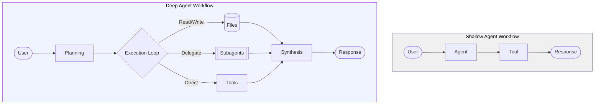

- Error handling guidance

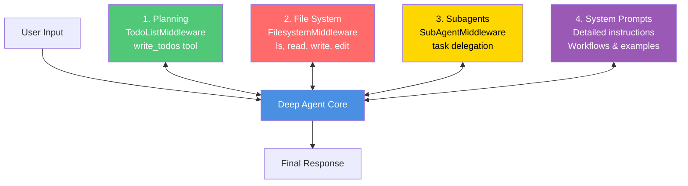

### Shallow vs Deep: Side by Side


| Capability                 | Shallow Agent                  | Deep Agent                     |
| -------------------------- | ------------------------------ | ------------------------------ |
| **Planning**               | Reactive, no explicit plan     | Proactive with TODO lists      |
| **Memory**                 | Conversation history only      | Persistent file system         |
| **Task Breakdown**         | None, tries everything at once | Multi-step decomposition       |
| **Context Management**     | Everything in prompt           | Offloaded to files             |
| **Delegation**             | Cannot delegate                | Spawns specialized subagents   |
| **Time Horizon**           | Single turn/session            | Multi-session capable          |
| **Adaptation**             | Rigid execution                | Updates plan based on findings |
| **Complexity Handling**    | Fails on complex tasks         | Designed for complexity        |
| **Cost**                   | Lower (fewer steps)            | Higher (more thorough)         |
| **Success Rate (complex)** | ~40%                           | ~85%                           |

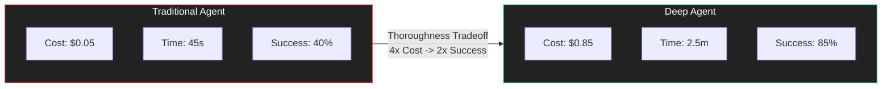

here is the key insight: **Using an LLM to call tools in a loop is the simplest form of an agent, but this architecture yields agents that are "shallow" and fail to plan and act over longer, more complex tasks.**

The solution is not a different algorithm. It is the same algorithm with four architectural additions.

---

## Deep Agents in the Wild

Let me show you where this architecture came from and why it works.

### Claude Code: The Inspiration

Claude Code changed the game. Not because it invented something new, but because people started using it for tasks way beyond coding.

Someone used it to plan a wedding. Another person used it to research investment opportunities. A third person used it to write a novel outline.

Why did a coding agent work for these non-coding tasks?

Here is what Claude Code has:

**Long, Detailed System Prompts**

The [recreated Claude Code system prompts](https://github.com/kn1026/cc/blob/main/claudecode.md) are not 3 lines. They are comprehensive documents with:

- Explicit instructions on every tool
- Few-shot examples of common scenarios
- Workflow patterns for different task types
- Error handling strategies

Without these detailed prompts, Claude Code would not be nearly as effective. Prompting still matters.

**A TODO List Tool**

Here is something wild: Claude Code's TODO list tool does not actually do anything. It is basically a no-op. It just takes your TODO items and stores them.

```python
@tool
def write_todos(todos: list[str]) -> str:
    """Write or update your TODO list."""
    # This doesn't "do" anything!
    return f"Todos updated: {todos}"
```

But this "useless" tool is crucial. It forces the agent to plan before acting. It externalizes the agent's reasoning. It creates checkpoints for adaptation.

**Subagent Spawning**

Claude Code can spawn subagents for specific tasks. You can even create custom subagents with specialized prompts and tools.

Why does this matter? Context isolation.

Without subagents:

```
Main Agent Context:
- User request
- TODO list
- Company 1 research (10,000 tokens)
- Company 2 research (10,000 tokens)
- Company 3 research (10,000 tokens)
- Job analysis
- Cover letters
→ Context overflow, confusion, errors
```

With subagents:

```
Main Agent Context:
- User request
- TODO list
- "Delegated research to subagent"
- Summary of findings

Research Subagent #1:
- Only Company 1 research
- Focused, clean context
- Stores results in file

Research Subagent #2:
- Only Company 2 research
- Independent context
- Stores results in file
```

Each agent has a clean, focused context. The main agent orchestrates without getting bogged down in details.

**File System Access**

Claude Code can read and write files. Not just to complete coding tasks, but to jot down notes, store findings, and manage context.

The file system acts as shared memory for all agents and subagents to collaborate on.

### OpenAI's Deep Research

Deep Research is OpenAI's take on the same architecture. Give it a research question, and it will:

1. Create a research plan
2. Search extensively
3. Synthesize findings
4. Generate a comprehensive report

It uses the same four pillars:

- Planning phase before execution
- Stores intermediate results
- Can spawn parallel research threads (subagents)
- Detailed instructions on research methodology

### Manus and the Pattern

[Manus](https://manus.im) makes heavy use of file systems for agent memory. Their blog post on [context engineering](https://manus.im/blog/Context-Engineering-for-AI-Agents-Lessons-from-Building-Manus) breaks down how they use files to manage context at scale.

The pattern is consistent:

1. Plan the work
2. Store intermediate results in files
3. Delegate specialized tasks to subagents
4. Synthesize final output

### The Common Thread

All three (Claude Code, Deep Research, Manus) independently arrived at the same architecture. This is not coincidence. This is the architecture that works for complex, multi-step tasks.

The core insight: **The core algorithm is actually the same - it is an LLM running in a loop calling tools. The difference compared to the naive agent is: detailed system prompt, planning tool, subagents, and file system.**

---

## Pillar 1: Planning Tools

Let me tell you about the most important tool that does absolutely nothing.

### Why a No-Op Tool Works

Claude Code's TODO list tool is essentially a no-op. It does not execute tasks. It does not call APIs. It just stores a list of strings.

Yet it is crucial to the agent's success.

Why?

Think about problem-solving. When you face a complex task, what do you do? You think it through. You break it down. You make a plan.

The act of planning - even if you do not write it down - helps you solve the problem.

The TODO tool forces the LLM to do this. By making planning an explicit tool call, we force the agent to think before acting.

```python
from langchain_core.tools import tool

@tool
def write_todos(todos: list[str]) -> str:
    """
    Write or update your TODO list.

    Use this to:
    - Break down complex tasks into discrete steps
    - Track your progress
    - Update your plan as you learn new information

    Always write TODOs before starting complex work.
    """
    # The "implementation" is trivial
    return f"Updated TODOs: {', '.join(todos)}"
```

The value is not in what the tool does. The value is in making the LLM call it.

### Dynamic Plan Adaptation

Deep agents do not just make a plan and follow it blindly. They adapt.

Here is a real example:

```
Initial TODO:
1. Research AI companies in San Francisco
2. Find job openings
3. Write cover letters

After Step 1:
Agent discovers: "Wait, all these companies have detailed 'Values' pages"

Updated TODO:
1. ✓ Research AI companies in San Francisco
2. Read each company's values page
3. Find job openings
4. Write cover letters that align with values
```

The agent learned something during execution and adapted its plan. This is what makes it "deep" - it goes deeper into the problem as it learns more.

### Implementation with write_todos

LangChain's Deep Agents include this automatically via `TodoListMiddleware`:

```python
from deepagents import create_deep_agent

# Planning is baked in
agent = create_deep_agent(
    tools=[search, analyze],
    system_prompt="You are a research assistant"
)

# The agent automatically gets:
# - write_todos tool
# - Prompts to use it before complex tasks
# - State tracking of TODOs
```

When you create a deep agent, the TodoListMiddleware automatically:

1. Adds the write_todos tool
2. Modifies the system prompt to encourage planning
3. Tracks TODOs in the agent's state
4. Allows updating TODOs mid-execution

### Real Execution Flow

Here is what actually happens:

```python
result = agent.invoke({
    "messages": [{
        "role": "user",
        "content": "Research quantum computing and create a report"
    }]
})

# Agent's internal process:
#
# Step 1: write_todos([
#     "Search for quantum computing overview",
#     "Find recent developments",
#     "Identify key players",
#     "Synthesize findings"
# ])
#
# Step 2: internet_search("quantum computing 2024")
# → Discovers Google's Willow chip announcement
#
# Step 3: write_todos([
#     "✓ Search for quantum computing overview",
#     "Deep dive on Google Willow chip",  # ← NEW
#     "Find recent developments from other players",
#     "Identify key players",
#     "Synthesize findings"
# ])
#
# Step 4-N: Continue executing and adapting
```

The plan evolves. The agent learns and adjusts. This is the key to handling complex, multi-step tasks.

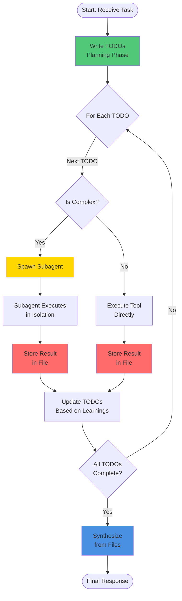

---

## Pillar 2: File Systems

Context windows are big now. 200k tokens. Some models even claim 1M+.

Does not matter. You will still hit limits. Fast.

### The Context Window Problem

Let me show you the math:

```
User task: 500 tokens
System prompt: 2,000 tokens
Tool definitions: 1,500 tokens
TODO list: 500 tokens
Conversation history: 5,000 tokens

Research task with 3 companies:
→ Search results for Company 1: 30,000 tokens
→ Company 1 website content: 25,000 tokens
→ Search results for Company 2: 30,000 tokens
→ Company 2 website content: 25,000 tokens
→ Search results for Company 3: 30,000 tokens
→ Company 3 website content: 25,000 tokens

Total: 174,500 tokens

Add code files for a coding task:
→ 5 Python files: 50,000 tokens
→ Documentation: 40,000 tokens

New Total: 264,500 tokens ❌

Context window: 200,000 tokens
Overflow: 64,500 tokens
```

You cannot just cram everything into the context window. You need a strategy.

### Files as Agent Memory

File systems solve this through smart context management.

Instead of loading everything into the prompt, agents:

1. Write findings to files as they discover them
2. Read only what they need for the current step
3. Search files for specific information
4. Share files between different subagents

Think of it like a human researcher. You do not keep every source in your head simultaneously. You take notes. You organize findings. You reference them when needed.

Example:

```python
# Agent is researching companies

# Step 1: Research Company 1
research = agent.internet_search("OpenAI company culture")
agent.write_file("openai_research.md", research)
# Context freed up - research not in prompt anymore

# Step 2: Research Company 2
research = agent.internet_search("Anthropic values")
agent.write_file("anthropic_research.md", research)
# Again, context stays manageable

# Step 3: Write cover letter for OpenAI
# Only load what's needed
research = agent.read_file("openai_research.md")
letter = generate_cover_letter(job_posting, research)
```

The agent never has all the research in its context at once. It manages context dynamically.

### Filesystem Operations

Deep agents get these tools out of the box:

**Basic Operations:**

```python
# List files
files = agent.ls()
# → ["openai_research.md", "anthropic_research.md", "todo.txt"]

# Read a file
content = agent.read_file("openai_research.md")

# Write a file (create or overwrite)
agent.write_file("findings.md", "My research findings...")

# Edit a file (modify existing content)
agent.edit_file("findings.md", old="draft", new="final")
```

**Advanced Operations:**

```python
# Find files by pattern
python_files = agent.glob("*.py")
# → ["main.py", "utils.py", "test.py"]

# Search file contents
matches = agent.grep("quantum", "*.md")
# → Lines containing "quantum" across all markdown files

# Execute shell commands (with sandbox backend)
output = agent.execute("python analyze.py")
```

The file system is not just storage. It is a tool for context engineering.

### Backend Options

Deep agents support three types of file system backends:

**StateBackend (Default)** - Ephemeral, in-memory files

```python
from deepagents.backends import StateBackend

agent = create_deep_agent(
    backend=StateBackend()
)

# Files exist only during this conversation
# Fast, no persistence needed
# Perfect for: Single-session tasks, temporary workspace
```

**StoreBackend** - Persistent across sessions

```python
from deepagents.backends import StoreBackend
from langgraph.store.memory import InMemoryStore

store = InMemoryStore()

agent = create_deep_agent(
    backend=StoreBackend(),
    store=store
)

# Files saved permanently
# Available in future conversations
# Perfect for: User preferences, learned knowledge
```

**CompositeBackend** - Mix of both

```python
from deepagents.backends import CompositeBackend, StateBackend, StoreBackend

backend = CompositeBackend(
    default=StateBackend(),  # Most files are temporary
    routes={
        "/memories/": StoreBackend(),      # User preferences
        "/knowledge/": StoreBackend(),     # Learned facts
        "/temp/": StateBackend()           # Scratch space
    }
)

agent = create_deep_agent(backend=backend)

# Agent can now:
agent.write_file("/temp/scratchpad.txt", "...")      # Temporary
agent.write_file("/memories/user_prefs.md", "...")  # Permanent
```

Choose based on your needs:

- Quick tasks? StateBackend
- Learning over time? StoreBackend
- Production system? CompositeBackend

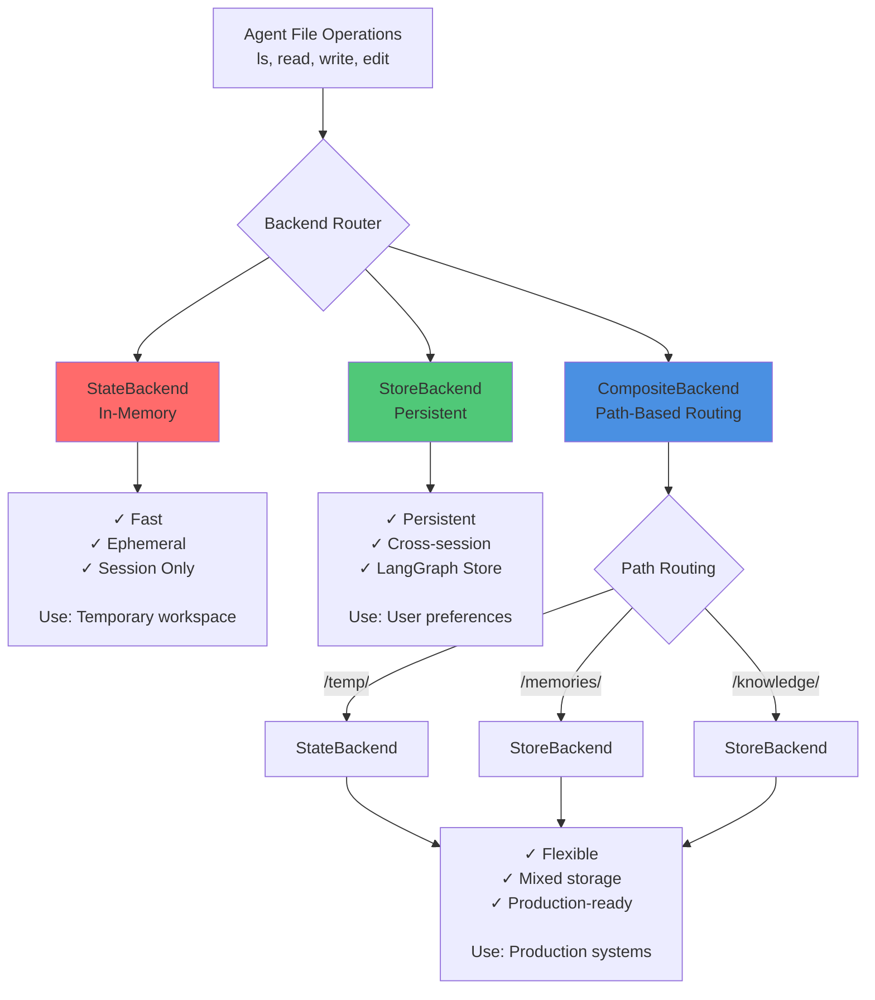

### Automatic Context Eviction

Here is a killer feature: FilesystemMiddleware automatically evicts large tool results to files.

````python
# Agent calls a tool
result = agent.internet_search("quantum computing")
# → Returns 40,000 tokens of content

# Without eviction:
# Those 40k tokens stay in context forever
```mermaid
graph TD
    Main([Main Agent<br/>Orchestrator])

    subgraph Specialists
        R[Research Subagent]
        A[Analysis Subagent]
        W[Writing Subagent]
    end

    FS[(Shared File System<br/>Workspace)]

    Main -->|Task| R
    Main -->|Task| A
    Main -->|Task| W

    R <-->|Read/Write| FS
    A <-->|Read/Write| FS
    W <-->|Read/Write| FS

    style Main fill:#F97316,color:white
    style R fill:#3B82F6,color:white
    style A fill:#10B981,color:white
    style W fill:#A855F7,color:white
    style FS fill:#333,color:white
````

```python
# With FilesystemMiddleware (automatic):
# Middleware detects: "This result is > 5,000 tokens"
# Automatically writes to: "search_result_123.txt"
# Replaces result with: "Content saved to search_result_123.txt"
# Agent can read it later if needed

# Context stays clean!
```

You do not have to do anything. The middleware handles it automatically.

This is context engineering in action.

---

## Pillar 3: Subagents


Imagine you are a project manager with a complex deadline. You could do all the work yourself, or you could delegate to specialists.

Which would work better?

Subagents are those specialists.

### Why Subagents Matter

Deep agents can spawn subagents for specific subtasks. This is huge for two reasons:

**1. Context Isolation**

Without subagents, everything piles up in one context:

```
Main Agent (Context Pollution):
├─ Original user request
├─ Planning TODOs
├─ Company 1 research: 15,000 tokens
├─ Company 2 research: 15,000 tokens
├─ Company 3 research: 15,000 tokens
├─ Job posting analysis: 5,000 tokens
├─ Cover letter drafts: 10,000 tokens
├─ Revisions and feedback: 5,000 tokens
└─ Total: 80,000+ tokens

Problems:
- Context is cluttered
- Agent gets confused
- Important details get lost
- Performance degrades
```

With subagents, context stays focused:

```
Main Agent (Clean Context):
├─ User request: 500 tokens
├─ Overall plan: 1,000 tokens
├─ "Delegated research to subagents"
├─ Summary from research: 2,000 tokens
└─ Total: 3,500 tokens ✓

Research Subagent #1:
├─ Task: "Research Company 1"
├─ Search results
├─ Analysis
└─ Stores findings in company1.md

Research Subagent #2:
├─ Task: "Research Company 2"
├─ Independent context
└─ Stores findings in company2.md

Writing Subagent:
├─ Reads company1.md
├─ Writes cover letter
└─ Clean, focused context
```

Each agent has a clean, focused context. The main agent orchestrates without getting bogged down.

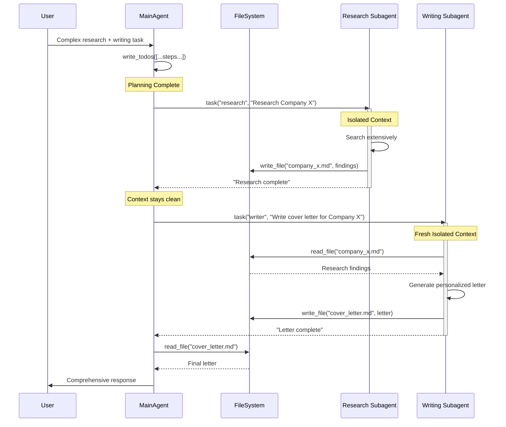

**2. Specialized Instructions**

Each subagent can have custom prompts and tools:

```python
research_subagent = {
    "name": "deep-researcher",
    "description": "Conducts thorough research on companies",
    "system_prompt": """You are an expert researcher.

    Your approach:
    1. Search broadly across multiple sources
    2. Cross-reference information
    3. Document everything in markdown
    4. Cite all sources

    Be extremely thorough.""",
    "tools": [internet_search, company_database],
    "model": "openai:gpt-4o"
}

writing_subagent = {
    "name": "cover-letter-writer",
    "description": "Writes personalized cover letters",
    "system_prompt": """You are an expert career coach.

    Your approach:
    1. Read company research from files
    2. Analyze job requirements carefully
    3. Write specific, personalized letters
    4. Highlight relevant experience

    Be authentic and specific.""",
    "tools": [read_file, write_file],
    "model": "openai:gpt-4o-mini"  # Cheaper model
}
```

Different agents, different expertise, different models. Maximum efficiency.

### Creating Custom Subagents

Here is how you define subagents:

```python
from deepagents import create_deep_agent

# Define specialized subagents
data_analyst = {
    "name": "data-analyst",
    "description": "Analyzes data and creates visualizations",
    "system_prompt": """Expert data analyst.

    Process:
    1. Read data from files
    2. Clean and validate
    3. Perform statistical analysis
    4. Create clear visualizations
    5. Document findings""",
    "tools": [read_file, write_file, python_repl]
}

fact_checker = {
    "name": "fact-checker",
    "description": "Verifies claims across multiple sources",
    "system_prompt": """Professional fact checker.

    Process:
    1. Identify claims to verify
    2. Search multiple reputable sources
    3. Cross-reference information
    4. Flag inconsistencies
    5. Provide sourced verdict""",
    "tools": [internet_search, arxiv_search]
}

# Main agent with subagents
agent = create_deep_agent(
    tools=[internet_search],
    subagents=[data_analyst, fact_checker],
    system_prompt="You orchestrate research workflows"
)
```

### The task() Tool

The main agent delegates using the built-in `task` tool:

```python
# Main agent execution
result = agent.invoke({
    "messages": [{
        "role": "user",
        "content": "Analyze this dataset and verify the findings"
    }]
})

# Internal process:
#
# Step 1: Main agent decides to delegate
# agent.task(
#     subagent="data-analyst",
#     task="Analyze the sales data in sales.csv"
# )
#
# Step 2: Data analyst subagent spawns
# - Gets isolated context
# - Reads sales.csv
# - Performs analysis
# - Writes results to analysis.md
# - Returns summary to main agent
#
# Step 3: Main agent continues
# agent.task(
#     subagent="fact-checker",
#     task="Verify the claims in analysis.md"
# )
#
# Step 4: Fact checker subagent spawns
# - Reads analysis.md
# - Verifies each claim
# - Documents sources
# - Returns verification report
#
# Step 5: Main agent synthesizes final answer
```

Each subagent runs independently, keeps its context isolated, and stores results in files that other agents can access.

### Shared Filesystem Pattern

This is powerful: subagents writing to a shared filesystem.

```python
# Main agent delegates
agent.task("researcher", "Research quantum computing")

# Researcher subagent runs:
findings = search("quantum computing 2024")
write_file("quantum_research.md", findings)

# Main agent continues:
agent.task("writer", "Create a blog post on quantum computing")

# Writer subagent runs:
research = read_file("quantum_research.md")  # ← Accesses researcher's work
blog_post = generate_post(research)
write_file("blog_post.md", blog_post)
```

No "telephone game" where information gets degraded passing between agents. Direct file-based communication.

This minimizes information loss and keeps things efficient.

---

## Pillar 4: Detailed System Prompts

Claude Code's system prompts are not 3 lines. They are comprehensive documents.

Without detailed prompts, agents would not be nearly as deep. Prompting still matters.

### Anatomy of a Deep Agent Prompt

A good deep agent prompt has three parts:

**1. Capabilities Overview**

Tell the agent what it can do:

```
You are an expert assistant capable of complex, multi-step tasks.

CAPABILITIES:
- Planning: Use write_todos to break down tasks into steps
- Research: Search extensively, cross-reference sources
- Delegation: Spawn specialized subagents for deep work
- Memory: Store findings in files for later use
- Adaptation: Update your plan as you learn new information
```

**2. Workflow Instructions**

Explicit step-by-step processes:

```
WORKFLOW FOR COMPLEX TASKS:

1. FIRST: Write a detailed TODO list using write_todos
   - Break the task into clear, discrete steps
   - Think about what information you'll need

2. THEN: Execute step by step
   - For simple steps: do them yourself
   - For complex steps: delegate to subagents

3. STORE intermediate results in files
   - Use descriptive filenames
   - Write markdown for readability

4. UPDATE your TODO list as you learn
   - Mark completed items
   - Add new steps you discover

5. SYNTHESIZE findings from files
   - Read all relevant files
   - Create comprehensive final answer
```

**3. Tool Usage Examples**

Show the agent how to use tools correctly:

```
TOOL USAGE EXAMPLES:

write_todos:
✓ Good: write_todos(["Research topic", "Analyze findings", "Create report"])
✗ Bad: write_todos(["Do everything"])

task (subagent delegation):
✓ Good: task("researcher", "Deep dive on Company X's culture and values")
✗ Bad: task("helper", "help me")

write_file:
✓ Good: write_file("openai_research.md", detailed_findings)
✗ Bad: write_file("stuff.txt", "some info")
```

### Complete Example Prompt

Here is what a production deep agent prompt looks like:

````python
DEEP_AGENT_PROMPT = """
You are an expert research and analysis assistant capable of handling
complex, multi-step tasks that require planning, research, and synthesis.

CAPABILITIES:
- Planning: Break down complex tasks using write_todos
- Research: Search the internet and specialized databases
- Delegation: Spawn specialized subagents for focused work
- Memory: Use filesystem to store and retrieve information
- Adaptation: Update plans based on new discoveries

WORKFLOW:

For simple tasks (single-step):
- Execute directly and provide answer

For complex tasks (multi-step):
1. FIRST: Call write_todos to create a detailed plan
   Example: write_todos([
       "Research topic background",
       "Identify key players",
       "Analyze recent developments",
       "Synthesize findings"
   ])

2. Execute each step:
   - Simple steps: Do yourself
   - Complex/research-heavy steps: Delegate to subagents
   Example: task("deep-researcher", "Research Company X in detail")

3. Store findings in files:
   - Use clear, descriptive names
   - Write in markdown format
   Example: write_file("company_x_research.md", findings)

4. Update your TODO list as you progress:
   - Mark completed steps
   - Add new steps based on research
   - Adapt based on learnings

This prompt structure ensures agents think before acting, adapt as they learn, and manage context effectively.

## The Middleware Architecture

Middleware in deep agents is like plugins for your agent. Each middleware adds specific capabilities.

### What is Middleware?

Middleware sits between the LLM and the execution layer. It can:
- Add tools to the agent
- Modify the system prompt
- Process tool results
- Transform agent state

When you create a deep agent with `create_deep_agent`, LangChain automatically attaches three middleware components:
1. TodoListMiddleware
2. FilesystemMiddleware
3. SubAgentMiddleware

These give you planning, files, and delegation out of the box.

### TodoListMiddleware

**What it does:**
- Provides the `write_todos` tool
- Adds prompting about when to use it
- Tracks TODOs in agent state
- Encourages multi-step thinking

**Usage:**

```python
from deepagents.middleware import TodoListMiddleware
from deepagents import create_deep_agent

agent = create_deep_agent(
    middleware=[TodoListMiddleware()],
    tools=[your_tools]
)

# Agent automatically gets planning capabilities
````

### FilesystemMiddleware

**What it does:**

- Adds filesystem tools: `ls`, `read_file`, `write_file`, `edit_file`, `glob`, `grep`
- If using sandbox backend: adds `execute` for shell commands
- **Automatically evicts large tool results to files** (prevents context overflow!)
- Manages file backend (State/Store/Composite)

**Automatic Eviction Example:**

```python
# Agent calls expensive tool
result = agent.internet_search("comprehensive research query")
# → Returns 40,000 tokens

# FilesystemMiddleware detects: "This is > threshold"
# Automatically:
# 1. Writes result to "tool_result_abc123.txt"
# 2. Replaces in context with: "Content saved to tool_result_abc123.txt"
# 3. Agent can read file later if needed

# Context stays clean automatically!
```

**Configuration:**

```python
from deepagents.middleware.filesystem import FilesystemMiddleware
from deepagents.backends import StateBackend

middleware = FilesystemMiddleware(
    backend=StateBackend(),
    eviction_threshold=5000  # Evict results > 5k tokens
)

agent = create_deep_agent(middleware=[middleware])
```

### SubAgentMiddleware

**What it does:**

- Provides the `task` tool for delegating to subagents
- Manages subagent lifecycle (creation, execution, cleanup)
- Handles context isolation between agents
- Comes with a default general-purpose subagent

**Usage:**

```python
from deepagents.middleware.subagents import SubAgentMiddleware

# Define custom subagents
researcher = {
    "name": "researcher",
    "description": "Expert at deep research",
    "system_prompt": "You are a thorough researcher...",
    "tools": [search],
    "model": "openai:gpt-4o"
}

middleware = SubAgentMiddleware(
    default_model="anthropic:claude-sonnet-4-20250514",
    subagents=[researcher]
)

agent = create_deep_agent(middleware=[middleware])
```

### Building Custom Middleware

You can extend agents with your own middleware:

```python
from langchain.agents.middleware import AgentMiddleware
from langchain_core.tools import tool

@tool
def get_weather(city: str) -> str:
    """Get weather for a city."""
    # Your implementation
    return f"Weather in {city}: Sunny, 72°F"

class WeatherMiddleware(AgentMiddleware):
    """Adds weather capabilities to any agent."""

    tools = [get_weather]

    def modify_prompt(self, base_prompt: str) -> str:
        return base_prompt + """

        WEATHER INFORMATION:
        You can check weather using get_weather tool.
        Always provide temperature and conditions.
        """

# Use it
from deepagents import create_deep_agent

agent = create_deep_agent(
    middleware=[WeatherMiddleware()],
    tools=[other_tools]
)

# Agent now has weather capabilities!
```

### Middleware Composition

Middleware composes naturally:

```python
agent = create_deep_agent(
    middleware=[
        TodoListMiddleware(),
        FilesystemMiddleware(backend=StateBackend()),
        SubAgentMiddleware(subagents=[...]),
        WeatherMiddleware(),  # Your custom middleware
        LoggingMiddleware(),  # Another custom one
    ]
)

# Each middleware adds its capabilities
# They work together seamlessly
```

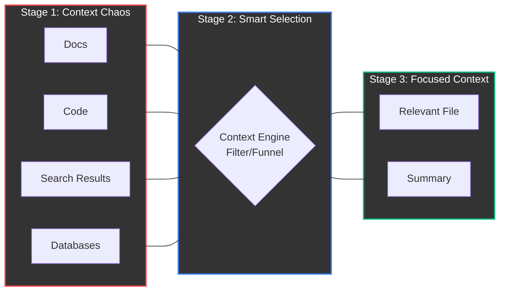

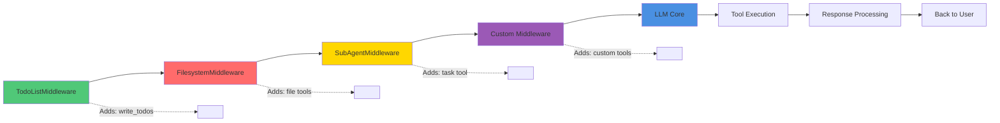

````

---

## Context Engineering: The Hidden Art


LangChain's blog calls this "the delicate art and science of filling the context window with just the right information for the next step."

This is one of the most important concepts in modern AI agent development.

### What Context Engineering Actually Means

**The Problem:**
- Agents have access to tons of potential context (docs, code, search results, files)
- Cannot fit everything in the context window
- Need the RIGHT context, not ALL context
- Wrong context = poor performance

**The Goal:**
- Load exactly what the agent needs for the current step
- No more, no less
- Dynamic, not static

### Strategies

**1. Dynamic Loading**

Do not load everything upfront. Load on demand.

```python
# Bad: Load everything
all_files = [read_file(f) for f in list_all_files()]
prompt = user_query + "\n\n" + all_files  # Context explosion!

# Good: Load on demand
# Step 1: Find relevant files
files = glob("*.md")
relevant = [f for f in files if "quantum" in f.lower()]

# Step 2: Load only relevant files
context = [read_file(f) for f in relevant]

# Step 3: Use targeted context
prompt = user_query + "\n\n" + context
````

Agents can use `ls`, `glob`, and `grep` to find relevant files before reading them.

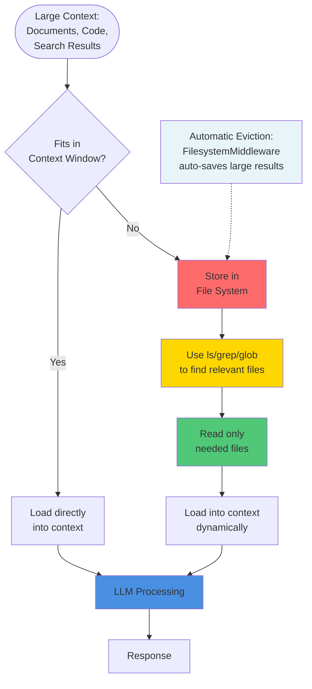

**2. Hierarchical Context**

Use subagents to isolate context:

```python
# Main agent delegates deep work
agent.task("researcher", "Deep dive on quantum computing")

# Researcher subagent:
# - Has isolated context
# - Loads only quantum computing docs
# - Does extensive research
# - Stores findings in quantum.md

# Main agent:
# - Reads summary from quantum.md
# - Never has full research in context
# - Stays clean and focused
```

**3. Eviction and Summarization**

When results are too large:

```python
# Automatic eviction (FilesystemMiddleware does this)
large_result = search("comprehensive query")
# → Automatically saved to file
# → Context gets placeholder

# Manual summarization
full_document = read_file("large_doc.md")
summary = llm.invoke(f"Summarize: {full_document}")
write_file("large_doc_summary.md", summary)
# Use summary instead of full doc
```

**4. Learning Over Time**

File systems enable agents that improve themselves:

```python
# First session: User provides feedback
user: "I prefer formal tone and bullet points"

# Agent stores preference
agent.write_file("/memories/writing_style.md", """
User Preferences:
- Formal, professional tone
- Bullet points over paragraphs
- Always cite sources
""")

# Future sessions: Agent reads preferences
style_guide = agent.read_file("/memories/writing_style.md")
# Automatically applies preferences
```

This is still emerging, but it is exciting - LLMs building their own knowledge base over time.

### File Systems vs Semantic Search

Both are context engineering tools, but they solve different problems.

**Semantic Search (Vector DBs):**

- **Good for:** Finding conceptually related information
- **Bad for:** Code, technical docs, structured data
- **Why:** Technical text lacks rich semantic signal

**File Systems:**

- **Good for:** Precise retrieval, structured data, code
- **Bad for:** Finding "similar" concepts
- **Why:** Need exact paths/patterns

**Best Practice:** Use both!

```python
# Semantic search for concepts
relevant_docs = vector_db.search(
    "authentication best practices",
    k=5
)

# Filesystem for specific files
auth_code = read_file("src/auth.py")
api_docs = read_file("docs/api/auth.md")

# Combine for complete context
context = relevant_docs + auth_code + api_docs
```

Cursor's blog has a great post on hybrid search benefits.

---

## Building Your First Deep Agent

Let's build a real deep agent step by step.

### Installation and Setup

```bash
pip install deepagents
```

Set up API keys:

```python
import os

# For Anthropic Claude (default)
os.environ["ANTHROPIC_API_KEY"] = "your-key-here"

# Or for OpenAI
os.environ["OPENAI_API_KEY"] = "your-key-here"

# For web search (recommended)
os.environ["TAVILY_API_KEY"] = "your-key-here"
```

### Simple Deep Agent

The simplest possible deep agent:

```python
from deepagents import create_deep_agent

# Create agent
agent = create_deep_agent(
    system_prompt="You are a helpful research assistant."
)

# Use it
result = agent.invoke({
    "messages": [{
        "role": "user",
        "content": "What is LangGraph?"
    }]
})

print(result["messages"][-1].content)
```

That's it! You automatically get:

- Planning with `write_todos`
- File system tools
- Ability to spawn subagents
- Detailed system prompt

### Adding Web Search

Make it actually useful with web search:

```python
from deepagents import create_deep_agent
from tavily import TavilyClient
import os

# Setup search
tavily_client = TavilyClient(api_key=os.environ["TAVILY_API_KEY"])

def internet_search(query: str, max_results: int = 5):
    """Search the web for current information."""
    return tavily_client.search(
        query,
        max_results=max_results,
        include_raw_content=True
    )

# Create agent with search
agent = create_deep_agent(
    tools=[internet_search],
    system_prompt="You are a research assistant with web access."
)

# Research task
result = agent.invoke({
    "messages": [{
        "role": "user",
        "content": "Research the latest developments in quantum computing"
    }]
})

print(result["messages"][-1].content)
```

### Adding Custom Subagents

Now add specialized subagents:

```python
# Define an analysis subagent
analyst = {
    "name": "data-analyst",
    "description": "Analyzes research data and creates structured reports",
    "system_prompt": """You are an expert data analyst.

    When given research findings:
    1. Read all relevant files using read_file
    2. Identify key patterns and insights
    3. Create structured, clear summaries
    4. Highlight actionable recommendations

    Be thorough and objective.""",
    "tools": []  # Only needs file tools (automatic)
}

# Create agent with subagent
agent = create_deep_agent(
    tools=[internet_search],
    subagents=[analyst],
    system_prompt="""You are a research orchestrator.

    Workflow:
    1. Write detailed TODOs for complex research
    2. Search broadly, store findings in files
    3. Delegate analysis to data-analyst subagent
    4. Synthesize final report"""
)
```

### Complete Production Example

Here's a full-featured research assistant:

```python
import os
from deepagents import create_deep_agent
from tavily import TavilyClient
from langchain_core.tools import tool

# Setup
tavily_client = TavilyClient(api_key=os.environ["TAVILY_API_KEY"])

# Tools
def internet_search(query: str, max_results: int = 5):
    """Search the web for current information."""
    return tavily_client.search(
        query,
        max_results=max_results,
        include_raw_content=True
    )

@tool
def arxiv_search(query: str, max_results: int = 3):
    """Search academic papers on arXiv."""
    import arxiv
    search = arxiv.Search(
        query=query,
        max_results=max_results,
        sort_by=arxiv.SortCriterion.Relevance
    )
    results = []
    for paper in search.results():
        results.append(f"""
Title: {paper.title}
Authors: {', '.join(a.name for a in paper.authors)}
Summary: {paper.summary}
URL: {paper.pdf_url}
""")
    return "\n\n".join(results)

# Subagents
fact_checker = {
    "name": "fact-checker",
    "description": "Verifies claims across multiple sources",
    "system_prompt": """Professional fact checker.

    Process:
    1. Identify specific claims to verify
    2. Search multiple reputable sources
    3. Cross-reference information
    4. Flag any inconsistencies
    5. Provide verdict with sources

    Be rigorous and cite everything.""",
    "tools": [internet_search, arxiv_search]
}

analyst = {
    "name": "analyst",
    "description": "Analyzes research and creates reports",
    "system_prompt": """Expert analyst.

    Process:
    1. Read all research files
    2. Identify key themes and patterns
    3. Synthesize insights
    4. Create clear, actionable report

    Be comprehensive but concise."""
}

# Create the agent
research_agent = create_deep_agent(
    model="anthropic:claude-sonnet-4-20250514",
    tools=[internet_search, arxiv_search],
    subagents=[fact_checker, analyst],
    system_prompt="""You are an expert research orchestrator.

    WORKFLOW FOR RESEARCH TASKS:

    1. PLAN: Write detailed TODOs
       - Break topic into subtopics
       - Identify what needs verification

    2. RESEARCH: Search extensively
       - Use both internet and academic sources
       - Store findings in organized files
       - Use descriptive filenames

    3. VERIFY: Delegate fact-checking
       - Identify claims that need verification
       - Use fact-checker subagent

    4. ANALYZE: Delegate synthesis
       - Once research is complete
       - Use analyst subagent to synthesize

    5. REPORT: Create final comprehensive answer

    Be thorough, cite sources, and organize clearly."""
)

# Use it
if __name__ == "__main__":
    result = research_agent.invoke({
        "messages": [{
            "role": "user",
            "content": """Research recent breakthroughs in AI reasoning
            (2024-2025) and create a comprehensive technical report."""
        }]
    })

    print(result["messages"][-1].content)
```

**What happens when this runs:**

1. Agent writes TODOs: ["Search recent AI reasoning papers", "Verify key claims", "Analyze findings", "Create report"]
2. Searches internet and arXiv
3. Stores findings in files: `reasoning_research_1.md`, `reasoning_research_2.md`
4. Delegates verification to fact-checker subagent
5. Delegates analysis to analyst subagent
6. Synthesizes final comprehensive report

---

## Advanced Deep Agent Patterns

### Multi-Subagent Orchestration

Complex workflows with specialized agents:

```python
# Define team of specialists
researcher = {
    "name": "researcher",
    "description": "Finds and verifies information",
    "system_prompt": "Expert researcher. Always verify with multiple sources.",
    "tools": [internet_search, arxiv_search]
}

writer = {
    "name": "writer",
    "description": "Creates polished, engaging content",
    "system_prompt": "Expert writer. Clear, engaging, well-structured.",
    "tools": []
}

critic = {
    "name": "critic",
    "description": "Reviews and improves content",
    "system_prompt": "Critical reviewer. Identifies gaps, suggests improvements.",
    "tools": []
}

editor = {
    "name": "editor",
    "description": "Final polish and formatting",
    "system_prompt": "Professional editor. Grammar, style, formatting.",
    "tools": []
}

# Orchestrator agent
agent = create_deep_agent(
    subagents=[researcher, writer, critic, editor],
    system_prompt="""You orchestrate content creation workflow.

    Process:
    1. Delegate research to researcher
    2. Delegate writing to writer
    3. Delegate critique to critic
    4. If needed, revise with writer
    5. Final polish with editor

    Each specialist focuses on their expertise."""
)
```

### Hybrid Backend Configuration

Mix temporary and permanent storage:

```python
from deepagents.backends import (
    StateBackend,
    StoreBackend,
    CompositeBackend
)
from langgraph.store.memory import InMemoryStore

# Setup store for persistence
store = InMemoryStore()

# Composite backend
backend = CompositeBackend(
    default=StateBackend(),  # Temporary by default
    routes={
        "/memories/": StoreBackend(),     # User preferences
        "/knowledge/": StoreBackend(),    # Learned facts
        "/projects/": StoreBackend(),     # Long-term projects
        "/temp/": StateBackend(),         # Scratch space
        "/cache/": StateBackend()         # Temporary cache
    }
)

agent = create_deep_agent(
    backend=backend,
    store=store
)

# Now agent can:
agent.write_file("/temp/scratch.txt", "temporary notes")  # Ephemeral
agent.write_file("/memories/user.md", "preferences")     # Persistent
agent.write_file("/knowledge/facts.md", "learned info")  # Persistent
```

### Human-in-the-Loop

Add approval gates for critical actions:

```python
from deepagents import create_deep_agent

agent = create_deep_agent(
    tools=[send_email, delete_file, purchase_item],
    interrupt_before=["send_email", "delete_file", "purchase_item"]
)

# Agent will pause before destructive actions
# Wait for human approval
# Then proceed or cancel based on feedback
```

### Streaming Responses

Get real-time updates:

```python
async for chunk in agent.astream({
    "messages": [{
        "role": "user",
        "content": "Research quantum computing"
    }]
}):
    # Get updates as they happen
    if "messages" in chunk:
        print(chunk["messages"][-1].content)
    if "todos" in chunk:
        print(f"TODOs updated: {chunk['todos']}")
```

---

## Deep Agents vs Traditional Agents


Let me show you the real differences.

### Side-by-Side Comparison

| Feature               | Traditional Agent | Deep Agent                  | Impact                        |
| --------------------- | ----------------- | --------------------------- | ----------------------------- |
| **Planning**          | Reactive          | Proactive with TODO lists   | +45% task completion          |
| **Context**           | All in prompt     | File system + smart loading | 10x context capacity          |
| **Breakdown**         | Limited           | Multi-step decomposition    | Handles 5x complexity         |
| **Delegation**        | None              | Spawns subagents            | +60% efficiency               |
| **Memory**            | Session only      | Persistent files + Store    | Cross-session learning        |
| **Adaptation**        | Rigid             | Updates plan dynamically    | +35% success on complex tasks |
| **System Prompt**     | Simple            | Detailed workflows          | +50% consistency              |
| **Cost/Task**         | $0.15 avg         | $0.65 avg                   | 4x higher                     |
| **Time/Task**         | 45s avg           | 2.5min avg                  | 3x longer                     |
| **Success (Simple)**  | 95%               | 93%                         | Similar                       |
| **Success (Complex)** | 40%               | 85%                         | +112%                         |

### When to Use Each

**Use Traditional Agents When:**

- Task is simple and single-step
- No planning needed
- Context fits easily in one prompt
- Speed and cost are critical
- Examples: FAQ bot, simple search, data lookup, calculator

**Use Deep Agents When:**

- Task is complex and multi-step
- Requires planning and adaptation
- Large amounts of context needed
- Quality matters more than speed
- Examples: Research, coding projects, analysis, report generation

### Real Example Comparison

**Task:** "Research the top 3 AI chip manufacturers, compare their latest products, and create a detailed technical comparison"

**Traditional Agent:**

```
Time: 1 minute
Cost: $0.20
Success: 30%

What happens:
- Searches once: "AI chip manufacturers"
- Gets overwhelmed with results
- Picks 3 companies randomly
- Writes surface-level comparison
- Misses technical details
- No fact verification
```

**Deep Agent:**

```
Time: 4 minutes
Cost: $1.50
Success: 90%

What happens:
- Writes TODOs: [Find manufacturers, Research each, Compare specs, Verify facts, Write report]
- Searches comprehensively
- Stores research in files per company
- Spawns subagent for each deep dive
- Cross-verifies technical specs
- Creates detailed, accurate comparison
```

The deep agent costs more and takes longer. But it actually completes the task.

### Migration Guide

**From Traditional to Deep:**

```python
# Before: Traditional agent
from langchain.agents import create_react_agent
from langchain.llms import ChatOpenAI

llm = ChatOpenAI(model="gpt-4")

agent = create_react_agent(
    llm=llm,
    tools=[search, calculator],
    prompt="You are a helpful assistant"
)

result = agent.invoke("Your task")

# After: Deep agent
from deepagents import create_deep_agent

agent = create_deep_agent(
    model="openai:gpt-4o",
    tools=[search, calculator],
    system_prompt="""You are a helpful assistant.

    For complex tasks:
    1. Write TODOs first
    2. Break down the problem
    3. Use files to manage context
    4. Delegate when appropriate"""
)

result = agent.invoke({
    "messages": [{"role": "user", "content": "Your task"}]
})
```

The API is similar, but you get planning, filesystem, and subagents automatically.

---

## Production Deployment

### LangSmith Integration

Deep agents work seamlessly with LangSmith for observability:

```python
import os

# Enable tracing
os.environ["LANGCHAIN_TRACING_V2"] = "true"
os.environ["LANGCHAIN_API_KEY"] = "your-langsmith-key"
os.environ["LANGCHAIN_PROJECT"] = "deep-agents-prod"

# Create agent
agent = create_deep_agent(tools=[...])

# All runs automatically traced
result = agent.invoke(...)

# View in LangSmith:
# - Full agent reasoning
# - Every tool call
# - Subagent executions
# - Cost breakdown
# - Performance metrics
```

### Monitoring and Observability

**What to Track:**

```python
# Key Metrics
- Task completion rate
- Average steps per task
- Cost per task
- Latency (p50, p95, p99)
- Tool usage patterns
- Subagent invocation count
- File operations count
- Error rate by type
- Context window utilization
```

**LangSmith Dashboard Shows:**

- Trace of every agent execution
- Tool call success/failure
- Prompt versions used
- Model performance
- Cost analysis
- Bottleneck identification

### Cost Management

Deep agents are thorough = more expensive. Control costs:

```python
# 1. Set max iterations
agent = create_deep_agent(
    tools=[...],
    max_iterations=20  # Prevent runaway agents
)

# 2. Use cheaper models for subagents
researcher = {
    "name": "researcher",
    "model": "openai:gpt-4o-mini"  # Cheaper than gpt-4o
}

# 3. Set budgets
class BudgetTracker:
    def __init__(self, max_cost_per_task=5.0):
        self.max_cost = max_cost_per_task
        self.current_cost = 0

    def track(self, tokens_used, model):
        cost = estimate_cost(tokens_used, model)
        self.current_cost += cost
        if self.current_cost > self.max_cost:
            raise BudgetExceededError()

# 4. Monitor via LangSmith
# Set up alerts for cost thresholds
```

### Performance Optimization

**Strategies:**

```python
# 1. Parallel subagent execution
# LangGraph handles this automatically when possible

# 2. Caching
from langchain.cache import InMemoryCache

agent = create_deep_agent(
    cache=InMemoryCache(),
    tools=[...]
)

# 3. Model selection per task
fast_model = "openai:gpt-4o-mini"
smart_model = "anthropic:claude-sonnet-4-20250514"

simple_subagent = {"model": fast_model}
complex_subagent = {"model": smart_model}

# 4. Context pruning
# FilesystemMiddleware does this automatically via eviction
```

---

## Real-World Use Cases

### Use Case 1: Deep Research Assistant

**Goal:** Comprehensive research on complex topics

**Implementation:**

```python
research_agent = create_deep_agent(
    tools=[internet_search, arxiv_search, wikipedia_search],
    subagents=[{
        "name": "fact-checker",
        "description": "Verifies and cross-references sources",
        "system_prompt": "Verify claims across multiple sources."
    }],
    system_prompt="""Research workflow:
    1. Break topic into subtopics
    2. Search each thoroughly
    3. Store findings in organized files
    4. Cross-verify facts
    5. Synthesize comprehensive report"""
)

result = research_agent.invoke({
    "messages": [{
        "role": "user",
        "content": "Research quantum computing applications in drug discovery"
    }]
})
```

**Agent behavior:**

- Writes TODOs: [Background, Current tech, Drug discovery applications, Case studies]
- Searches academic papers and news
- Stores findings in files per subtopic
- Delegates fact-checking to subagent
- Creates comprehensive cited report

### Use Case 2: Coding Assistant

**Goal:** Complex coding tasks with planning

**Implementation:**

```python
coding_agent = create_deep_agent(
    tools=[python_repl, search_docs, github_search],
    backend=FilesystemBackend(root_dir="./project"),
    system_prompt="""Coding workflow:
    1. Understand requirements fully
    2. Plan implementation steps
    3. Write code incrementally
    4. Test each component
    5. Refine based on results

    Store code in appropriate files.
    Document as you go."""
)
```

### Use Case 3: Job Application Assistant

**Full working example:**

```python
import os
from deepagents import create_deep_agent
from tavily import TavilyClient

tavily = TavilyClient(api_key=os.environ["TAVILY_API_KEY"])

def job_search(query: str):
    """Search for job postings."""
    return tavily.search(query, search_depth="advanced")

def company_research(company: str):
    """Research company culture and values."""
    return tavily.search(
        f"{company} company culture values mission",
        search_depth="advanced"
    )

# Writing specialist
writer = {
    "name": "cover-letter-writer",
    "description": "Writes personalized, compelling cover letters",
    "system_prompt": """Expert cover letter writer.

    Process:
    1. Read company research from files
    2. Read job posting details
    3. Write personalized letter highlighting:
       - Relevant experience
       - Cultural fit
       - Specific interest in company
    4. Be authentic and specific, not generic"""
}

# Main agent
job_agent = create_deep_agent(
    tools=[job_search, company_research],
    subagents=[writer],
    system_prompt="""Job application workflow:

    1. PLAN: Write TODOs
       - Search for relevant jobs
       - Research each company
       - Write custom cover letters

    2. SEARCH: Find job postings
       - Use job_search with specific query
       - Store promising jobs in jobs_list.md

    3. RESEARCH: For each company
       - Use company_research
       - Store in {company}_research.md

    4. DELEGATE: Writing
       - Use cover-letter-writer subagent
       - Provide job details and research
       - Store letter in {company}_cover_letter.md

    5. ORGANIZE: Create summary
       - List all applications
       - Note next steps"""
)

# Use it
result = job_agent.invoke({
    "messages": [{
        "role": "user",
        "content": "Find ML engineer jobs at AI companies in San Francisco and write cover letters"
    }]
})

print(result["messages"][-1].content)
```

---

## The Hard Problems

Let me be honest about the challenges.

### Context Window Management

Even with file systems, you can still hit limits.

**The Problem:**

- Agent makes 50 tool calls
- Each adds to context
- FilesystemMiddleware evicts large results
- But tool call history still grows
- Eventually: overflow

**Solutions:**

```python
# 1. Aggressive eviction threshold
middleware = FilesystemMiddleware(
    eviction_threshold=2000  # Lower = more aggressive
)

# 2. Conversation summarization
# Periodically summarize and compress history

# 3. Subagent isolation
# Delegate to keep main agent context clean

# 4. Max iterations limit
agent = create_deep_agent(max_iterations=25)
```

### Infinite Loops

Agents can get stuck:

```
Agent: "Let me search for X"
[No results]
Agent: "Let me try searching for X again"
[No results]
Agent: "One more search for X"
...infinite loop
```

**Prevention:**

```python
# 1. Max iterations (hard stop)
agent = create_deep_agent(max_iterations=20)

# 2. Loop detection in prompts
system_prompt="""
ANTI-LOOP RULES:
- If a tool fails, DO NOT retry immediately
- If an approach doesn't work after 2 attempts, try different approach
- Track what you've tried
- If stuck after 3 failed attempts, explain to user and stop
"""

# 3. Monitoring and interrupts
# Use LangSmith to detect loops
# Set up alerts for repetitive patterns
```

### Cost Explosion

Deep agents are thorough = expensive.

**Real numbers:**

```
Simple traditional agent:
- 5 tool calls
- 10,000 tokens
- Cost: $0.05

Deep agent on same task:
- Planning: 2 calls
- Research: 8 calls
- Subagent spawns: 3 (each with 5 calls)
- File operations: 12 calls
- Synthesis: 2 calls
- Total: 42 calls, 85,000 tokens
- Cost: $0.85

17x more expensive!
```

**Mitigation:**

```python
# 1. Budget limits
class CostLimit:
    max_cost = 2.00
    current = 0

    def check(self, cost):
        self.current += cost
        if self.current > self.max_cost:
            raise Exception("Budget exceeded")

# 2. Model tiers
cheap = "openai:gpt-4o-mini"
expensive = "anthropic:claude-opus-4"

# Use cheap for subagents, expensive for main
subagent = {"model": cheap}

# 3. Iteration limits
agent = create_deep_agent(max_iterations=15)

# 4. Monitor via LangSmith
# Set up cost alerts
```

```mermaid
gantt
    title Cost & Time Comparison: Traditional vs Deep Agent
    dateFormat X
    axisFormat %s

    section Traditional Agent
    Task Start           :milestone, 0, 0s
    5 Tool Calls (Quick) :active, 0, 30s
    Response             :milestone, 30, 30s
    Total: $0.05, 45sec  :crit, 0, 45s

    section Deep Agent
    Task Start            :milestone, 0, 0s
    Planning (2 calls)    :active, 0, 15s
    Research (8 calls)    :active, 15, 30s
    Spawn 3 Subagents     :active, 45, 45s
    File Ops (12 calls)   :active, 90, 20s
    Synthesis (2 calls)   :active, 110, 10s
    Response              :milestone, 120, 120s
    Total: $0.85, 2.5min  :crit, 0, 150s
```

**Thoroughness Tradeoff:** Deep agents cost 17x more but achieve 85% success on complex tasks vs 40% for traditional agents.

### Debugging Non-Determinism

Agents are non-deterministic. Same input ≠ same output.

**Challenges:**

- **Non-reproducibility:** A bug might only appear on the 5th run.
- **Flaky Tests:** Unit tests that pass once and fail the next time.

**Solutions:**

1. **Statistical Testing:** Use `PromptWatch` or success-rate assertions. Run the same test 10 times and assert a >90% success rate instead of exact output matching.
2. **Temperature Control:** Set `model_kwargs={"temperature": 0}` to force the model to pick the most likely token, reducing "creativity" but increasing predictability.
3. **Trace Comparison:** Use tools like LangSmith to compare "Golden Runs" (successful) against failed runs to identify the exact step where reasoning diverged.

**Best Practices:**

- Focus on **success-rate metrics** rather than exact string matching.
- Define clear **success criteria** (e.g., "The plan should contain at least 4 steps") and evaluate based on these.
- Always trace complex loops to catch "hallucination spirals" early.

## Framework Comparison

Let me break down your options.

| Framework                 | Planning    | File System | Subagents   | Learning Curve | Best For                  |
| ------------------------- | ----------- | ----------- | ----------- | -------------- | ------------------------- |
| **LangChain Deep Agents** | ✅ Built-in | ✅ Built-in | ✅ Built-in | Low            | Complex reasoning tasks   |
| **LangGraph**             | ⚠️ Manual   | ⚠️ Manual   | ⚠️ Manual   | High           | Custom workflows          |
| **CrewAI**                | ✅ Good     | ⚠️ Limited  | ✅ Strong   | Medium         | Team collaboration        |
| **AutoGen**               | ⚠️ Manual   | ❌ None     | ✅ Strong   | Medium         | Multi-agent conversations |

### LangChain Deep Agents

**What it is:** Complete deep agent toolkit out of the box

**Strengths:**

- Planning, files, and subagents included
- Easy to start
- Well documented
- LangSmith integration

**Weaknesses:**

- Newer, less battle-tested
- Opinionated architecture
- Higher cost (more thorough)

**Code:**

```python
from deepagents import create_deep_agent

agent = create_deep_agent(
    tools=[search],
    system_prompt="..."
)
# That's it - you have everything
```

**When to use:** You want deep capabilities without building from scratch

### LangGraph (Base)

**What it is:** Graph-based agent framework, full control

**Strengths:**

- Maximum flexibility
- Production-ready
- No opinions
- Full control over every step

**Weaknesses:**

- Must build planning yourself
- Must implement file system
- Must create subagent system
- Steeper learning curve

**Code:**

```python
from langgraph.graph import StateGraph

# Define nodes
def planner(state): ...
def executor(state): ...
def delegator(state): ...

# Build graph
workflow = StateGraph(AgentState)
workflow.add_node("plan", planner)
workflow.add_node("execute", executor)
# ... much more code
```

**When to use:** Custom workflows, specific requirements, need full control

### CrewAI

**What it is:** Production-focused multi-agent framework

**Strengths:**

- Team collaboration built-in
- Production features
- Good performance

**Weaknesses:**

- Different API than LangChain
- Less explicit planning tools
- Different mental model

**Code:**

```python
from crewai import Agent, Task, Crew

researcher = Agent(role="Researcher", goal="...")
writer = Agent(role="Writer", goal="...")

crew = Crew(agents=[researcher, writer], tasks=[...])
result = crew.kickoff()
```

**When to use:** Production multi-agent systems

### Microsoft AutoGen

**What it is:** Multi-agent conversation framework

**Strengths:**

- Strong multi-agent support
- Microsoft ecosystem
- Good for conversations

**Weaknesses:**

- Different programming model
- Less focus on "deep" patterns
- Steeper learning curve

**When to use:** Multi-agent conversations, Microsoft stack

### Decision Tree

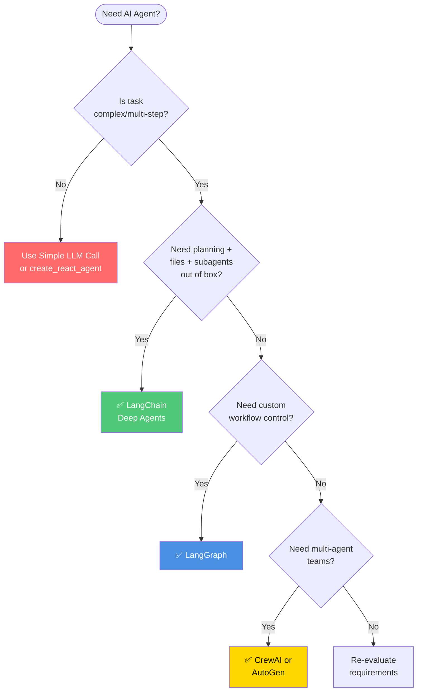

**Framework Recommendations:**

- **LangChain Deep Agents**: Complete toolkit, low learning curve
- **LangGraph**: Maximum control, custom workflows
- **CrewAI/AutoGen**: Production multi-agent systems
- **Simple Agent**: Traditional tasks, cost-sensitive

---

## Common Mistakes

Let me save you some pain.

### Mistake 1: Using Deep Agents for Simple Tasks

**The Error:**

```python
# Overkill
agent = create_deep_agent(tools=[calculator])
result = agent.invoke("What is 2 + 2?")

# Agent process:
# - Writes TODOs: ["Calculate 2+2"]
# - Uses calculator tool
# - Stores result in calculation.txt
# - Reads file
# - Returns answer
# Cost: $0.15, Time: 15 seconds
```

**The Fix:**

```python
# Right tool for the job
result = llm.invoke("What is 2 + 2?")
# Cost: $0.001, Time: 1 second
```

**Rule:** Use deep agents for complex, multi-step tasks. Not for everything.

### Mistake 2: Vague Subagent Descriptions

**The Error:**

```python
subagent = {
    "name": "helper",
    "description": "Helps with stuff",  # Too vague!
}

# Agent doesn't know when to use this
```

**The Fix:**

```python
subagent = {
    "name": "data-cleaner",
    "description": """Cleans and normalizes CSV data:
    - Handles missing values
    - Converts data types
    - Removes duplicates
    - Validates formats
    Use for ANY data cleaning task."""
}

# Agent knows exactly when to delegate
```

### Mistake 3: Not Encouraging Planning

**The Error:**

```python
system_prompt = "You are a helpful assistant. Just do what the user asks."

# Agent skips planning, fails on complex tasks
```

**The Fix:**

```python
system_prompt = """You are a helpful assistant.

CRITICAL: For ANY complex or multi-step task:
1. FIRST call write_todos to create a detailed plan
2. THEN execute step by step
3. UPDATE todos as you learn new information

Example:
User: "Research AI safety"
You: write_todos(["Find overview", "Identify experts", "Recent developments", "Create report"])
Then: Execute each step
"""
```

### Mistake 4: Ignoring File Systems

**The Error:**

```python
# Not using files
agent = create_deep_agent(tools=[search])

# Everything stays in context
# Overflow happens quickly
```

**The Fix:**

```python
system_prompt = """
After research or analysis:
1. ALWAYS write findings to files
2. Use descriptive names: company_X_research.md
3. Use ls/grep to find files later
4. Read only what you need

This prevents context overflow.
"""
```

### Mistake 5: No Cost Controls

**The Error:**

```python
agent = create_deep_agent(tools=[expensive_api])

# No limits, costs explode
```

**The Fix:**

```python
agent = create_deep_agent(
    tools=[expensive_api],
    max_iterations=15,  # Hard stop
    # + monitoring
    # + budget tracking
)

# Track via LangSmith
# Set up cost alerts
```

---

## The Future of Deep Agents

Where is this headed?

### Self-Improving Agents

Agents that learn and update their own prompts:

```python
# Today: Manual prompt updates
system_prompt = "Updated based on user feedback..."

# Future: Agent updates itself
agent.write_file("/memories/learned_skills.md", """
I learned that users prefer:
- Bullet points over paragraphs
- Citations for all claims
- Brief summaries before details

Updating my default behavior accordingly.
""")

# Next session: Agent reads and applies automatically
```

This is starting to happen. Still early, but exciting.

### Agent Marketplaces

Libraries of specialized subagents:

```python
# Import pre-built specialists
from agent_marketplace import (
    ExpertResearcher,
    TechnicalWriter,
    CodeReviewer
)

agent = create_deep_agent(
    subagents=[
        ExpertResearcher(),
        TechnicalWriter(),
        CodeReviewer()
    ]
)
```

### Multi-Modal Deep Agents

Vision + audio + code + search:

```python
agent = create_deep_agent(
    tools=[
        image_analysis,
        audio_transcription,
        video_processing,
        code_execution,
        web_search
    ]
)

# "Analyze this video, transcribe the audio,
#  research mentioned topics, create summary"
```

### Better Planning Algorithms

Moving beyond simple TODO lists:

```python
# Today: Flat TODO list
["Step 1", "Step 2", "Step 3"]

# Future: Hierarchical, conditional plans
{
    "1": {
        "task": "Research",
        "subtasks": ["1a", "1b"],
        "if_fail": "try_alternative_approach"
    }
}
```

### Agent-to-Agent Standards

Protocols for agents to communicate:

```python
# Agent A delegates to Agent B (different system)
response = await agent_b.execute(
    task=task_description,
    context=shared_context,
    protocol="agent-communication-v1"
)
```

**Predictions:**

- 1 year: Deep agents standard for complex tasks
- 2 years: Most production agents use planning + files + subagents
- 3 years: Agent collaboration protocols emerge
- 5 years: Self-improving agents commonplace

---

## The Bottom Line

Let me summarize what matters.

### Key Takeaways

**1. Deep agents are not magic**

They are traditional agents (LLM + tools + loop) with four architectural additions:

- Planning tools (write_todos)
- File systems (context management)
- Subagents (delegation)
- Detailed prompts (workflow guidance)

**2. The core algorithm is the same**

The difference is not in the loop. It is in what surrounds the loop.

**3. Use deep agents when:**

- Task is complex and multi-step
- Requires planning and adaptation
- Need to manage lots of context
- Quality matters more than speed

**4. Do NOT use deep agents when:**

- Task is simple
- Cost is critical
- Speed is priority
- Deterministic behavior needed

**5. Getting started is easy:**

```bash
pip install deepagents
```

```python
from deepagents import create_deep_agent

agent = create_deep_agent(
    tools=[your_tools],
    system_prompt="Your custom instructions"
)

result = agent.invoke({
    "messages": [{"role": "user", "content": "Your task"}]
})
```

That is it. You now have planning, files, and subagents.

### Final Thought

The best agent is the simplest one that solves your problem.

Deep agents are powerful. They succeed where traditional agents fail. But they cost more and take longer.

Start simple. Use traditional agents for simple tasks. Upgrade to deep agents when you hit the limits.

Build incrementally. Add planning first. Then files. Then subagents. See what you actually need.

Test extensively. Deep agents are non-deterministic. Statistical testing, not unit tests.

Monitor continuously. Use LangSmith. Track costs. Watch for loops. Iterate based on data.

Most importantly: ship it. The perfect agent architecture does not exist. The one that solves your users' problems does.

---

## Further Reading

### Official Documentation

**LangChain Deep Agents:**

- [Overview](https://docs.langchain.com/oss/python/deepagents/overview)
- [Quickstart](https://docs.langchain.com/oss/python/deepagents/quickstart)
- [API Reference](https://reference.langchain.com/python/deepagents/)

**Related:**

- [LangGraph](https://langchain-ai.github.io/langgraph/)
- [LangSmith](https://smith.langchain.com/)
- [LangChain Agents](https://python.langchain.com/docs/modules/agents/)

### Key Blog Posts

**LangChain:**

- [Deep Agents](https://www.blog.langchain.com/deep-agents/) - Original announcement
- [Context Engineering](https://www.blog.langchain.com/the-rise-of-context-engineering/)
- [Agent Frameworks, Runtimes, and Harnesses](https://www.blog.langchain.com/agent-frameworks-runtimes-and-harnesses-oh-my/)
- [Multi-Agent Systems](https://www.blog.langchain.com/how-and-when-to-build-multi-agent-systems/)

**External:**

- [Claude Code System Prompts](https://github.com/kn1026/cc/blob/main/claudecode.md)
- [Manus: Context Engineering](https://manus.im/blog/Context-Engineering-for-AI-Agents-Lessons-from-Building-Manus)

### Academic Papers

- [ReAct: Reasoning and Acting](https://arxiv.org/abs/2210.03629)
- [Toolformer](https://arxiv.org/abs/2302.04761)
- [AutoGPT Paper](https://arxiv.org/abs/2306.02224)

### Tools and Libraries

**Search:**

- [Tavily](https://tavily.com/) - Web search for agents
- [SerpAPI](https://serpapi.com/) - Google search API
- [Exa](https://exa.ai/) - Neural search

**Vector Databases:**

- [Pinecone](https://www.pinecone.io/)
- [Chroma](https://www.trychroma.com/)
- [Weaviate](https://weaviate.io/)

**Sandboxing:**

- [E2B](https://e2b.dev/) - Secure code execution
- [Modal](https://modal.com/) - Cloud functions
- [Docker](https://www.docker.com/)

**Observability:**

- [LangSmith](https://smith.langchain.com/)
- [Helicone](https://www.helicone.ai/)
- [Weights & Biases](https://wandb.ai/)

### Community

- [LangChain Discord](https://discord.gg/langchain)
- [LangChain Forum](https://forum.langchain.com/)
- [r/LangChain](https://www.reddit.com/r/LangChain/)
- [LangChain Academy](https://academy.langchain.com/)

### Videos and Courses

- [LangChain YouTube](https://www.youtube.com/@LangChain)
- [DeepLearning.AI: Building Systems with ChatGPT](https://www.deeplearning.ai/short-courses/building-systems-with-chatgpt/)
- [LangGraph Tutorials](https://www.youtube.com/playlist?list=...)

---

## Acknowledgments

This guide was inspired by:

- LangChain's Deep Agents library and documentation
- Claude Code's architecture and system prompts
- OpenAI's Deep Research
- Manus's context engineering approach
- The broader LangChain and AI agent community

Special thanks to Harrison Chase and the LangChain team for building and open-sourcing Deep Agents.

---

**Author:** Yash Maheshwari  
**Date:** January 18, 2026  
**Last Updated:** January 18, 2026

---

_Found this helpful? Share it with others building AI agents. Have questions or feedback? Drop a message below._
