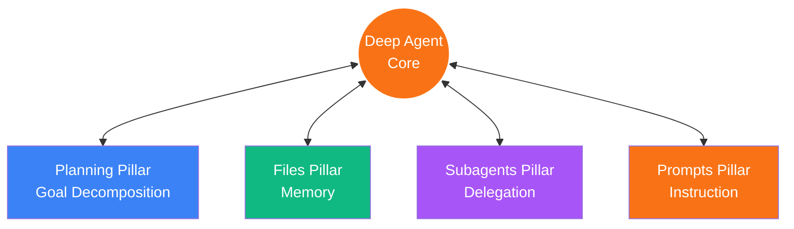
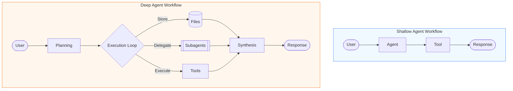
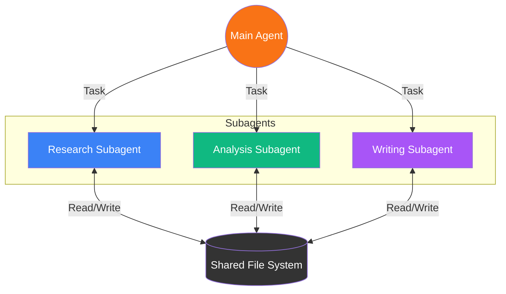

# Mermaid Diagrams for Deep Agents Blog

Use these Mermaid definitions to generate diagrams or visualize the concepts described in `images.md`.

## Diagram 1: Hero/Cover Concept (Structure)

```mermaid
graph LR
    subgraph Shallow [Shallow Agent]
        direction TB
        SA((Agent))
        T1[Tool 1]
        T2[Tool 2]
        T3[Tool 3]
        SA --> T1
        SA --> T2
        SA --> T3
        style SA fill:#3B82F6,stroke:#fff,color:#fff
    end

    subgraph Deep [Deep Agent]
        direction LR
        DA((Deep Agent))

        subgraph Pillars
            Plan[Planning<br/>(Checklist)]
            File[Files<br/>(Folder)]
            Sub[Subagents<br/>(Nodes)]
            Prompt[Prompts<br/>(Docs)]
        end

        DA === Plan
        DA === File
        DA === Sub
        DA === Prompt

        style DA fill:#F97316,stroke:#A855F7,stroke-width:4px,color:#fff
    end
```

## Diagram 2: Four Pillars Visualization



## Diagram 3: Context Engineering


## Diagram 4: Shallow vs Deep Workflow Comparison



## Diagram 5: Subagent Delegation



## Diagram 6: Cost vs Quality Tradeoff

```mermaid
graph LR
    subgraph Traditional ["Traditional Agent"]
        T_Cost[Low Cost: $0.05]
        T_Time[Fast: 45s]
        T_Success[Fail: 40% Success]
        style Traditional fill:#1a1a1a,stroke:#EF4444,color:#fff
        style T_Success fill:#450a0a,stroke:#EF4444
    end

    subgraph Deep ["Deep Agent"]
        D_Cost[Higher Cost: $0.85]
        D_Time[Slower: 2.5m]
        D_Success[High Success: 85%]
        style Deep fill:#1a1a1a,stroke:#10B981,color:#fff
        style D_Success fill:#064e3b,stroke:#10B981
    end

    Traditional -->|The Tradeoff: Thoroughness| Deep
```


